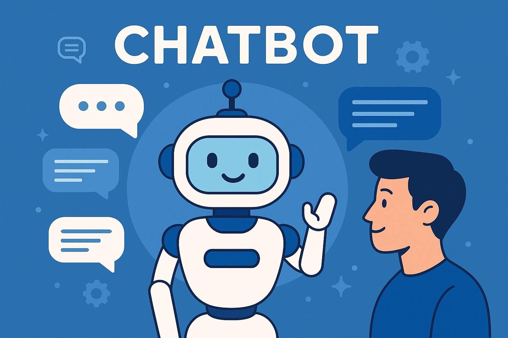
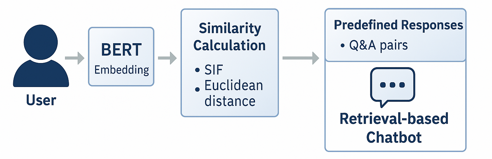
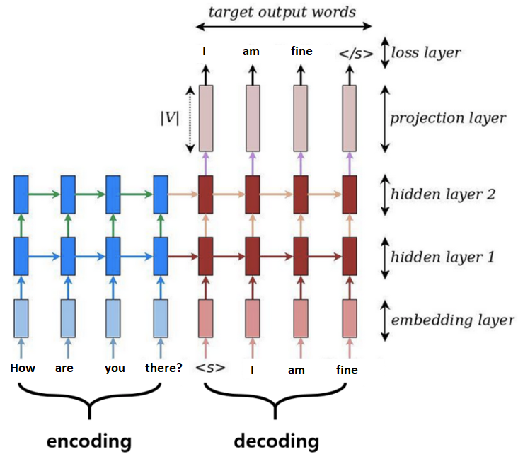
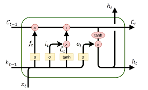
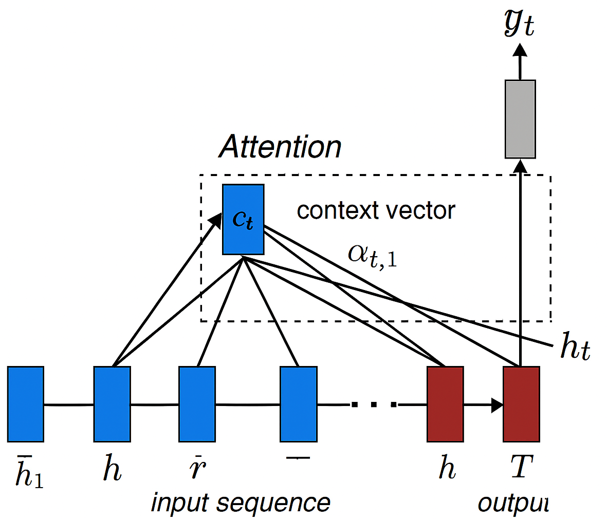
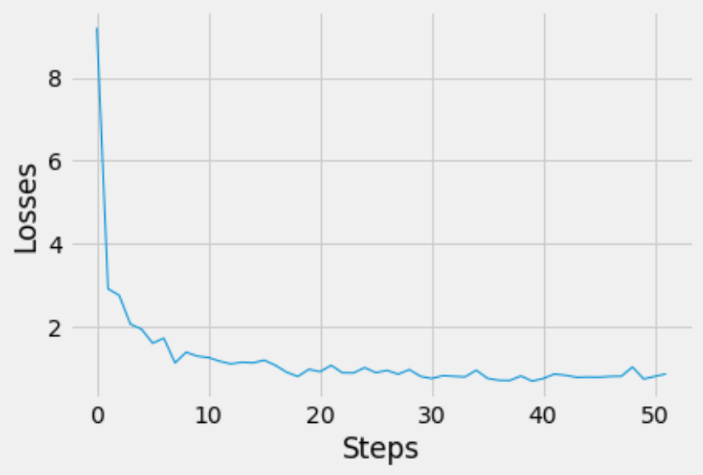
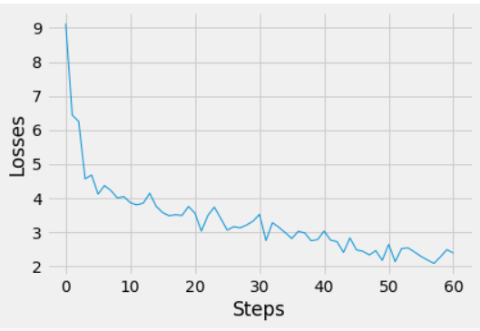
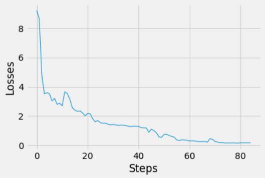

<h1 align="center">
  <i>Chatbot</i>
</h1>

  <b>Simple Retrieval-based & Generative-based Chatbot for Engaging Conversations 🗣️</b>  
  <b>Sepehr Ghamari*, Mohammad Mahdi Shojaeifar*</b> 
  <b>*Electrical Engineering Department, Amirkabir University of Technology</b>

  
  
  

  

<b>⭐️ If <code>Chatbot</code> is helpful for you, please help star this repo. Thanks! 😊</b>

## 📚 Table of Contents

- [📌 Overview](#overview)
- [🔧 Features](#features)
- [🚀 Technologies](#technologies)
- [📊 Data Preprocessing and Augmentation](#data-preprocessing-and-augmentation)
- [🧠 Model Architecture](#model-architecture)
- [📈 Training Results](#training-Results)
- [🧪 Inference](#inference)

🧪 Inference

## 📌 Overview

This project implements **two types of chatbots**:

1. **Retrieval-based Chatbot** – Fetches the most relevant predefined response using semantic similarity.
2. **Generative-based Chatbot** – Generates responses from scratch using seq-to-seq archirecture made by LSTM cells and attention mechanism.

It was developed as a senior undergraduate thesis to explore NLP techniques for conversational systems, especially for Persian text.

## 🔧 Features

- ✅ **Preprocessing pipeline** including tokenization, lemmatization, and sentence segmentation.
- 🤖 **Retrieval module** utilizing `BERT` embeddings with **SIF** (Smooth Inverse Frequency) and **Euclidean distance** for response selection.
- 🧠 **Generative module** trained on Q/A-style conversational datasets, capable of producing coherent and context-aware replies.
- 🗂 Includes sample conversations for both retrieval and generative models.

## 🚀 Technologies

- Python
- PyTorch
- HuggingFace Transformers (BERT)
- NLTK, NumPy, Matplotlib

## 📊 Data Preprocessing and Augmentation

### 🔹 Retrieval-Based

For the retrieval-based chatbot, a dataset consisting of **biographies of 500 well-known individuals** was used. All biographies were **collected from Wikipedia** and used as source material for question-answer pairs in the chatbot.

1. All texts were segmented **sentence by sentence**.
2. **Stopwords** and other low-impact words were removed to improve training efficiency.
3. A **dictionary of remaining words** was created for use in both the training and testing stages.

### 🔹 Generative-Based

For the generative chatbot, we used a **conversational dataset from the Amazon website**, containing approximately **320,000 Q&A pairs** extracted from interactions between customers and support operators.

1. All **Q&A pairs** were segmented **sentence by sentence**.
2. **Word Representation**: The project used a **dictionary lookup** method.  
  After collecting all unique words and assigning an index to each, the model was trained using these indexed tokens.
3. Unimportant or low-impact words were removed to enhance learning performance.
4. A **vocabulary of used words** was constructed, assigning a unique **index to each word** for embedding and decoding.
5. During inference, the same dictionary was used to **convert predicted indices back to words**, enabling coherent response generation.

## 🧠 Model Architecture
### 🔹 Retrieval-Based

  

### 🔹 Generative-Based

####  Full Model Overview

This project implements a **generative chatbot** using a sequence-to-sequence (seq2seq) model with **LSTM-based encoders and decoders**, optionally enhanced with an **attention mechanism**. Below are the components:

  

- The **encoder** processes input sentences (e.g., "How are you there?") into hidden representations.
- The **decoder** generates target responses (e.g., "I am fine") word by word.
- A **projection layer** maps decoder outputs to vocabulary probabilities.

####  LSTM-Based Sequence Modeling

  

- **LSTM units** are used in both encoder and decoder to capture long-range dependencies.
- Each LSTM cell maintains a **cell state** and a **hidden state**, helping preserve context across sequences.

####  Attention Mechanism

  

- The attention layer computes a **context vector** at each decoding step by focusing on relevant parts of the input sequence. This mechanism improves the model’s ability to handle **long and complex inputs** during response generation.

## 📈 Training Results(Generative Model)

### 🔹 Loss vs. Training Steps

The following chart shows the training loss decreasing over time, indicating convergence of the generative chatbot:

  
  
  

  <b>Fig. 4:</b> Training loss: 
  <i>(a)</i> Exp1, <i>(b)</i> Exp2, <i>(c)</i> Exp3.

- The model was trained over *50* steps using an LSTM-based encoder-decoder.
- Learning rate decay and teacher forcing were used to stabilize training.

## 🧪 Inference

Below are some representative examples of Q&A pairs generated by the trained model:

### 🔹 Retrieval-Based

We compared different response selection techniques for the **retrieval-based chatbot**:

- **WV**: Word Vector Averaging
- **SIF**: Smooth Inverse Frequency
- **BERT**: Sentence-level BERT Embeddings (best performance)

<b>Click to expand generated Q&A examples</b>

    Question: When is Ali Daei’s birthday

    Real: 21 March 1969
    WV: He went on to score 23 goals in 38 games for the club from 1994 to 1996
    SIF: Milan at the San Siro
    BERT: 21 march 1969

    Question: How many goals Ali Daei scored in Perspolis

    Real: 23
    WV: Yet even at Hertha he was not a hugely important player, since he was only one of the
    squad’s many successful players, who were to fulfill Hertha’s Bundesliga and UEFA Champions League dreams
    SIF: He also scored in a 1–1 draw against A
    BERT: 23

    Question: Did Daei scored in UEFA Champions League
    Real: yes
    WV: After his success with Bank Tejarat FC, in 1994 Daei joined one of Tehran’s leading
    clubs, Persepolis
    SIF: He also scored in a 1–1 draw against A

    BERT: da ei became the first asian player ever to feature in a uefa champions league match .
    he scored his first and second goal in the uefa champions league

    Question: How many goals Daei scored in international matchs?

    Real: 109
    WV: Yet even at Hertha he was not a hugely important player, since he was only one of the
    squad’s many successful players, who were to fulfill Hertha’s Bundesliga and UEFA Champions League dreams
    SIF: He also scored in a 1–1 draw against A
    BERT: 23

    Question: Why Daei was unhappy at Bayern

    Real: This coupled with the Iranian national team’s scheduling, Daei had found very little
    time for playing. Daei was unhappy with his position in the club
    WV: Ali Daei (born 21 March 1969) is an Iranian former professional footballer, football
    manager and businessman
    SIF: Yet even at Hertha he was not a hugely important player, since he was only one of the
    squad’s many successful players, who were to fulfill Hertha’s Bundesliga and UEFA Champions League dreams
    BERT: da ei was unhappy with his position in the club

### 🔹 Generative-Based

The following examples illustrate how the generative model responds to open-ended questions. The model shows emergent traits (e.g., hobbies, personality) while sometimes generating inconsistent or amusing outputs — a known trait of basic seq2seq models.

<b>Click to expand generated Q&A examples</b>

    tell me about yours
		i am a mechanic i love to cook i drive a lot it 
		
		hi
		hi 
		
		hello how are you?
		i am fine you 
		
		thanks. what are you doing?
		i am a college student i love to cook 
		
		who are you?
		im wiccan 
		
		do you eat food?
		yes i like eating food 
		
		what is your food?
		i like to eat meat and you 
		
		which food do you like?
		i like food i like food i love it and one 
		
		what are you doing?
		i am a stay at home mom with my mom 
		
		what are you?
		i am a mechanic lots 
		
		are you machine?
		yes just robot or thats great 
		
		what is the different between football and basketball?
		i like rock climbing but i like to go mountain biking 
		
		which sport do you like?
		yeah i like dogs 
		
		what is animal?
		hi there how are you 
		
		do you like dogs?
		yeah i like 
		
		what does you like?
		i like all software is all software of all greek is all greek of live also 
		
		do you have animal?
		no 
		
		who am i
		im a student 
		
		do you have job?
		i do not i am a fan of the company of music 
		
		do you like music?
		yes 
		
		what do you like to do?
		i like to play cricket 
		
		are you student?
		i am a student what about you 
		
		yes i am student too
		what do you mean 
		
		who is your wife?
		i am a huge fan of sorry i like to go mountain biking 
		
		are you man or woman or robot?
		thats male 
		
		what is your sex?
		what is your favorite color mine is grey 
		
		blue is beautiful color
		blue 
		
		what is your favourite job?
		i like rock climbing 
		
		who is your father?
		i am a human i love guitar
		
		who is your mother?
		i am a huge fan of a young one 
		
		do you have parent?
		yes i do 
		
		who are your parents?
		i like to eat a lot of do you like 
		
		tell me about yourself
		i am a fast talker and a fast typer who loves the color red 
		
		do you want to eat me?
		yes i do 
		
		am i delicious food?
		what are you 
		
		are you football player?
		here i dont know 
		
		say your name
		do you have any hobbies 
		
		do you have any hobbies 
		yeah is my hobby with flower with flower with flower with flower with flower 
		
		say hello
		hello 
		
		print bah bah
		i love burgers it 

## 🙏 Acknowledgements

This project was completed as part of our undergraduate thesis at the **Electrical Engineering Department, Amirkabir University of Technology (Tehran Polytechnic)**.

We would like to express our deepest gratitude to:

- **Dr. AmirAboulfazl Sooratgar** and **Dr. MohammadBagher Menhaj**, for their guidance, expertise, and continuous encouragement throughout the project.
- **Dr. Ali Doost Mohammadi**, for providing valuable insights and academic support as our advisor.
- Our fellow classmates and colleagues who provided feedback, tested the chatbot, and inspired us to refine our system.
- The developers and open-source communities behind **PyTorch**, **Transformers**, and other libraries that made this work possible.

This work was a valuable exploration into natural language understanding and generative modeling, and we hope it contributes to future development of Persian-language conversational AI.

## 📬 Contact

If you have any questions or feedback, feel free to contact us at:

📧 sepehrghamri@gmail.com

---

 
 

